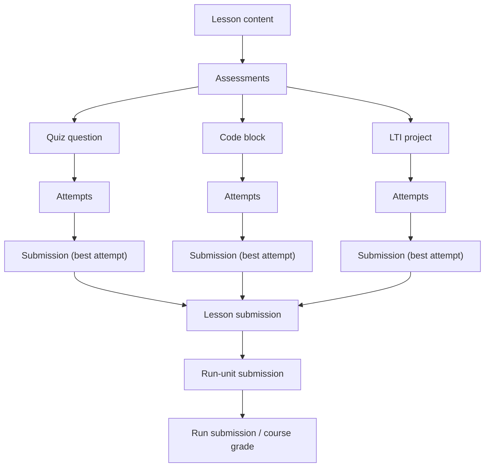
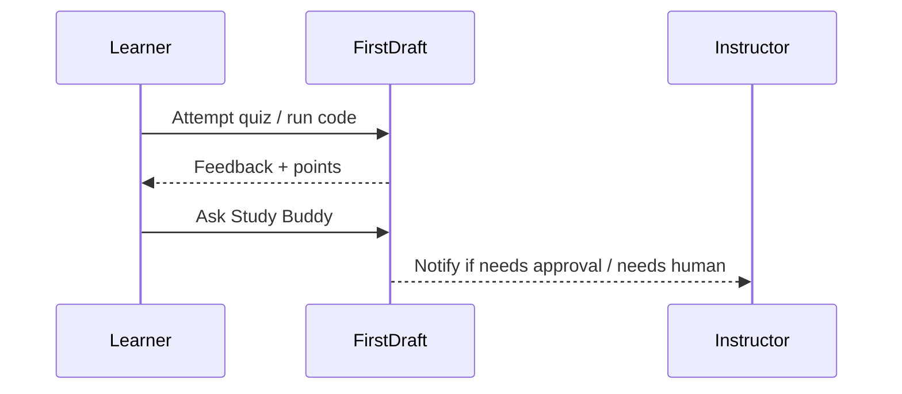

# First Draft: Learning, Instructing, and Authoring Overview

First Draft is a learning platform for teaching technical courses. Its design principle is:

> Tighten the feedback loop for learners, instructors, and authors.

This document is intentionally detailed. It’s written for technical instructors evaluating First Draft, and it uses First Draft’s own lesson features to "show, not just tell."

<div class="alert alert-info">

Want a kitchen-sink lesson for reference? [Here is the source code for this lesson here](https://raw.githubusercontent.com/appdev-lessons/platform-overview/refs/heads/main/content.md).

Have a general question about the platform; e.g. issues writing lessons or configuring a course? Click the button in the bottom right corner to "Chat with Study Buddy"!
</div>

## Quick feature index

If you want a fast scan, start here. Everything below is expanded in later sections.

<div class="bleed-full">

| Category | Capabilities (high-level) |
|---|---|
| Lesson authoring | Markdown + Learn-flavored extensions, raw HTML, Bootstrap classes, Font Awesome icons, KaTeX math, Mermaid, syntax highlighting (line numbers, line/col highlight), copyable blocks, local assets via `assets/` |
| Interactivity | Quizzes (choose best/all, free text, numeric), runnable code blocks (Ruby/Python/HTML/Hurl), graded Ruby code blocks with tests, optional instructor approvals |
| Learner UX | Progress indicators, assessment breakdown table, reset attempts without losing credit, prerequisites + locking, "peekable" locked lessons, calendar view with time estimates, tags, in-lesson notes/annotations |
| Instructor UX | Gradebook (score vs progress, late penalties), withhold/release units, per-student overrides (due dates, waive penalties, unrestrict), invites, secrets, exports |
| Study Buddy | Integrated AI tutor (Socratic vs direct), anonymous mode, copy-code-to-Study-Buddy, human escalation ("page a human"), prompt configuration + versioning, oversight tooling |
| Integrations | GitHub-connected lessons (branches → preview lessons), Cloudinary asset hosting + uploads, LTI tool provider + tool consumer, optional Stripe purchase/trial gating |

</div>


### Video guides

You may want to begin by watching these videos. The written notes contain much more detail, so do read and refer to them, but the video guides give a brief overview of features and functionality:

<div class="alert alert-info">

As we encourage our students to actively experiment while watching videos, we encourage you as well to pause, experiment, and read while watching these videos. Try to create your own lessons, courses, and runs! Make edits and change the configuration! View the instructor abilities! And ask Study Buddy if you're confused by anything!

**Note:** You can use the ↗ arrow icon to pop the video open in a new tab while you experiment.
</div>

#### Learning on firstdraft.com

<iframe src="https://share.descript.com/embed/M5gpvPaaQ3L" width="640" height="360" frameborder="0" allowfullscreen></iframe>

#### Instructing on firstdraft.com

<iframe src="https://share.descript.com/embed/VcZvNgADC67" width="640" height="360" frameborder="0" allowfullscreen></iframe>

#### Authoring on firstdraft.com

<iframe src="https://share.descript.com/embed/eSlpWC3GM2E" width="640" height="360" frameborder="0" allowfullscreen></iframe>

#### Authoring GitHub-managed lessons on firstdraft.com

<iframe src="https://share.descript.com/embed/mTPatEOZkdp" width="640" height="360" frameborder="0" allowfullscreen></iframe>

---

## The mental model: lessons, courses, runs, units

If you understand these nouns, everything else fits.

### Lesson

A **lesson** is the atomic unit of content: Markdown rendered into a web page, with embedded interactive elements. Lessons can include:

- Narrative content (text, diagrams, math, embedded media)
- Assessments (quiz questions, runnable code blocks, graded code blocks, project launches)
- Support context (Study Buddy and discussions; notes/annotations)

### Course

A **course** is a structured collection of units (usually lessons), plus course-level configuration such as:

- Ordering and hierarchy (including nested "course units")
- Default grading and pacing policies (passing thresholds, late discounts)
- A Study Buddy prompt (optional) to shape AI behavior for the course

### Run

A **run** is an instance of a course for a specific cohort/term. Runs are where operational concerns live:

- Due dates (in a specific time zone)
- Enrollment (learner/instructor roles, invites, access links)
- Gradebook exports and instructor dashboards
- Run-wide "secrets" shared with learners (API keys, credentials, etc.)
- Optional purchase/trial gating and "peekability"

### Unit

Lessons contained in a course/run structure are called **units**.

Units are where pacing and gating is configured:

- Weight (relative contribution to grade)
- Passing score (threshold for unlocking)
- Late discount (penalty for after-due-date work)
- Essential vs optional (optional units don’t block progress)
- Withheld (temporarily hidden by instructor)
- Unrestricted (available regardless of prerequisites)
- Trial (public preview gating)

### Data flow (conceptual)

This diagram is a helpful way to reason about grading and progress:



In plain language:

- Learners generate attempts.
- The platform retains the best attempt per assessment.
- Best attempts roll up into a lesson score.
- Lesson scores roll up into run/unit progress, then into a run grade.

## Roles, permissions, and access control

First Draft distinguishes *what you can see* (access) from *what you can edit* (authoring permissions). In practice, many people occupy multiple roles (e.g., an instructor who also authors).

### Learners vs instructors (run access)

Runs can grant access to users with a role:

- **Learner**: progresses through units, earns points, uses Study Buddy, views calendar/secrets.
- **Instructor**: sees instructor dashboards, gradebook exports, approvals, and override controls.

If a run is launched via LTI (e.g., from Canvas), First Draft can infer learner vs instructor roles from the LTI launch payload.

### Authors and collaborators (content editing)

Lessons/courses/runs can also have **collaborators** with permission levels like:

- read
- write
- admin

This is how teams author together: you can grant a colleague write/admin access to a lesson or course without giving them global privileges.

### Guests, trial lessons, and purchase gating

First Draft supports:

- **Guest browsing** (no account) for runs that have *trial lessons*
- **Trial lessons**: units explicitly marked as trial can be visible to guests/non-purchasers
- Optional **purchase gating** for paid cohorts (e.g., Stripe payment link + trial preview)

This makes it possible to host a public preview without creating a separate marketing environment.

### Open vs closed lessons

Lessons can be public ("open") or restricted. Restricted lessons require appropriate access (e.g., course enrollment or collaboration).

### Invitation links and invites

Runs can enroll learners via:

- Direct **invites** (email-based)
- Shareable **invitation links** (tokenized join URLs)

Both patterns support common course operations (roster imports, rolling enrollment, workshop links, etc.).

## Lesson authoring deep dive

First Draft is Markdown-first because technical course content benefits from:

- Versioned review (diffs, PRs)
- Portability (plain text, readable)
- Composability (code, math, diagrams, tables)

### Two authoring workflows

You can author lessons either:

1. **Inline in the platform** (web Markdown editor)
2. **From GitHub** (connect a repo and treat `content.md` as the source of truth)

Both approaches can coexist: even GitHub-connected lessons can be edited inline, and edits can be synced back to GitHub as commits.

### GitHub-connected lessons

GitHub-connected lessons follow a strict repo convention:

- `content.md` at repo root
  - First line: `# Title` (parsed as lesson title)
  - Remaining content: lesson body
- `assets/` directory
  - Images/gifs referenced from `content.md` via relative paths like `assets/example.png`

When connected, the lesson receives a URL containing a unique ID followed by the repo name (e.g., `https://firstdraft.com/lessons/799-platform-overview`), which provides a handy reference to both the lesson and its source repo.

Behavior:

- Commits/pushes update the rendered lesson automatically.
- Branches create independent preview lessons (useful for PR review). Branch lessons can be found from the main lesson's "Other branches" UI, which links to a `/branches` page.
- Local `assets/` references are uploaded/hosted and rewritten to served URLs.
- Even GitHub-connected lessons can be edited inline on the platform. Inline edits are committed back to the repo automatically (with a generic commit message), keeping both locations in sync. Small fixes like typos are convenient to make inline; larger rewrites are better done via external editors and GitHub commits.

Operationally, this enables a tight curriculum iteration loop:

- Draft changes on a branch → get a preview lesson URL → review in pull request → merge to `main` branch → production lesson updates automatically. The branch lesson can then be deleted.

### Learn-flavored Markdown

First Draft supports a number of authoring features beyond "vanilla" Markdown.

Before you begin, familiarize yourself with [the basics of Markdown syntax](https://www.markdownguide.org/cheat-sheet/):

#### Links open in a new tab by default

By default, links open in a new tab so learners don’t lose their place. If you want same-tab behavior:

```
[Jump to quizzes](#quiz-questions){: target="_self" }
```
{: copyable }

#### Images (drag/drop or `assets/`)

You can:

- Drag-and-drop images in the inline editor (the platform uploads and inserts a hosted URL).
- Reference repo assets from `assets/` in GitHub-connected lessons:

```

```
{: copyable }

(**Note:** the asset path should read `(assets/example.png)` for actual rendering; `path-to-assets` is used here to prevent actual parsing in this example.)

Make anything full-width:

```

{: .bleed-full }
```
{: copyable }

#### Raw HTML anywhere

You can drop down to HTML when needed (e.g., iframes, custom layouts, complex tables). When mixing Markdown inside raw HTML elements, omit initial indentation within the element for correct rendering.

#### Bootstrap styling anywhere

You can attach [Bootstrap classes](https://getbootstrap.com/docs/5.3/getting-started/introduction/) to any element:

```markdown
This is a callout box.
{: class="alert alert-primary" }
```
{: copyable }

This renders as:

This is a callout box.
{: class="alert alert-primary" }

#### Font Awesome icons

You can use [Font Awesome](https://fontawesome.com/icons) icons in the lesson, including "pro" icons:

```html
<i class="fa-regular fa-copy"></i>

<i class="fa-light fa-computer-classic"></i>
```

To produce

<i class="fa-regular fa-copy"></i> 

and 

<i class="fa-light fa-computer-classic"></i>


#### Copyable code blocks

Use `{: copyable }`, which adds a copy button (<i class="fa-regular fa-copy text-success"></i>) on the right side, to allow learners to copy a static code block:

    ```
    export API_KEY="replace-me"
    ```
    {: copyable }

This renders as:

```
export API_KEY="replace-me"
```
{: copyable }

#### Code block titles (file names)

Attach a filename label:

    ```ruby
    get "/movies", to: "movies#index"
    ```
    {: filename="config/routes.rb" }

This renders as:

```ruby
get "/movies", to: "movies#index"
```
{: filename="config/routes.rb" }

#### Line and column highlighting in fenced code

Add highlight options after the language tag in a fenced code block, inside brackets:

- individual lines: `ruby{1}` or `ruby{1,2,4,5}`
- line ranges: `ruby{1-3}`
- individual columns: `ruby{1:(3)}` or `ruby{1:(3,4,5)}`
- column ranges: `ruby{1:(1-6)}` or `ruby{3:(9-13)}`

Any combination works, and highlighting also works with HTML and ERB code blocks (e.g., `erb{1:(1-3)}`).

Example:

    ```ruby{1:(1-6),3:(9-13)}
    tokens = ["hello", "world", "!"]
    tokens.each do |token|
      print token
      print " " if token.count("a-zA-Z") > 0
    end
    ```

This renders as:

```ruby{1:(1-6),3:(9-13)}
tokens = ["hello", "world", "!"]
tokens.each do |token|
  print token
  print " " if token.count("a-zA-Z") > 0
end
```

#### Math (KaTeX)

Use LaTeX math inside `$$ ... $$` (double dollar-sign delimiters, not the single `$` used in vanilla LaTeX):

```
$$
\Large
\text{score} = \frac{\text{points earned}}{\text{points possible}}
$$
```

This renders as:

$$
\Large
\text{score} = \frac{\text{points earned}}{\text{points possible}}
$$

The implementation uses [KaTeX](https://katex.org/) and is focused on math rendering. Arbitrary LaTeX formatting commands (e.g., `\textbf{}`, `\emph{}`) will not render — use standard Markdown for text styling. In general, if you take an existing LaTeX equation from your notes and wrap it in `$$` above and below, the equation will render as expected.

For instance:

```
$$
\Large
\begin{aligned}
  & \phi(x,y) = \phi \left(\sum_{i=1}^n x_ie_i, \sum_{j=1}^n y_je_j \right)
  = \sum_{i=1}^n \sum_{j=1}^n x_i y_j \phi(e_i, e_j) = \\
  & (x_1, \ldots, x_n) \left( \begin{array}{ccc}
      \phi(e_1, e_1) & \cdots & \phi(e_1, e_n) \\
      \vdots & \ddots & \vdots \\
      \phi(e_n, e_1) & \cdots & \phi(e_n, e_n)
    \end{array} \right)
  \left( \begin{array}{c}
      y_1 \\
      \vdots \\
      y_n
    \end{array} \right)
\end{aligned}
$$
```

Renders as:

$$
\Large
\begin{aligned}
  & \phi(x,y) = \phi \left(\sum_{i=1}^n x_ie_i, \sum_{j=1}^n y_je_j \right)
  = \sum_{i=1}^n \sum_{j=1}^n x_i y_j \phi(e_i, e_j) = \\
  & (x_1, \ldots, x_n) \left( \begin{array}{ccc}
      \phi(e_1, e_1) & \cdots & \phi(e_1, e_n) \\
      \vdots & \ddots & \vdots \\
      \phi(e_n, e_1) & \cdots & \phi(e_n, e_n)
    \end{array} \right)
  \left( \begin{array}{c}
      y_1 \\
      \vdots \\
      y_n
    \end{array} \right)
\end{aligned}
$$

#### Mermaid diagrams

Use fenced `mermaid` blocks:

    ```mermaid
    sequenceDiagram
      participant Learner
      participant FirstDraft
      participant Instructor
      Learner->>FirstDraft: Attempt quiz / run code
      FirstDraft-->>Learner: Feedback + points
      Learner->>FirstDraft: Ask Study Buddy
      FirstDraft-->>Instructor: Notify if needs approval / needs human
    ```

This renders as:



#### Lists (practical note)

In complex list items (especially when embedding blocks), insert blank lines between items to keep layout predictable. Content within list items needs to be within a containing element — blank lines between items achieve this.

#### Asides

Place an `<aside>` element *after* the element you want it to appear next to. Asides can contain Markdown, images, code blocks, and lists. Avoid putting critical-path content in asides — use them for supplementary context. For content that doesn't need to be visible in the flow at all, use standard [Markdown footnotes](https://github.blog/changelog/2021-09-30-footnotes-now-supported-in-markdown-fields/) instead.

```html
<aside>
This supplementary note appears alongside the preceding element.
</aside>
```
{: copyable }

This renders as (see right margin):

<aside>
This supplementary note appears alongside the preceding element.
</aside>

#### Blockquotes

Standard Markdown blockquotes work as expected:

```
> The ability to quote is a serviceable substitute for wit.
>
> — W. Somerset Maugham
```
{: copyable }

This renders as:

> The ability to quote is a serviceable substitute for wit.
>
> — W. Somerset Maugham

### Environment variables for runnable/graded code

Lessons can define environment variables that are passed to sandboxed code execution (useful for API keys, configuration, or reproducibility). This is separate from "Secrets" (which are displayed to learners in a run).

## Quiz questions

Quiz questions are first-class lesson elements. They support immediate feedback and contribute points to the lesson grade.

Supported question types:

- `choose_best` (single correct)
- `choose_all` (multiple correct; partial credit)
- `free_text` (lenient text matching; supports fallback)
- `free_text_number` (numeric; supports fallback)
- `needs_approval` workflow (instructor review)

### Anatomy of a quiz question

Quiz questions are authored as a Markdown list, followed by a declaration line:

```
- Prompt
- Option A
  - Feedback if selected
- Option B
  - Feedback if selected
  - Additional feedback if selected
{: .choose_best #unique_id_4 title="Title" points="1" answer="2" }
```
{: copyable }

Each option can have one or more indented feedback lines (sub-bullets). Feedback is shown to the learner when that option is selected — this is how incorrect answers can teach.

Key attributes:

- `.choose_best` / `.choose_all` / `.free_text` / `.free_text_number`
- `#unique_id` (Must be unique within the lesson; used for persistence. Any questions with the same ID in the same lesson will be treated as the same question.)
- `title="..."` (Used in progress/grade views and as a header for runnable code blocks.)
- `points="..."` (Integer points possible.)
- `answer="..."` (Index of correct option(s), or `any` in some modes; indexing begins at 1.)
- `needs_approval="true|false"` (optional)

### choose_best (demo)

- Which statement best describes First Draft’s quiz design?
- "A quiz is just a score."
  - Not quite — each option can include feedback, so the question can teach.
- "Every option is an opportunity for feedback."
  - Correct — incorrect answers can explain misconceptions.
- "Quizzes are only for final assessment."
  - In First Draft they’re used continuously, often as micro-checks.
{: .choose_best #fd_v2_quiz_choose_best_demo title="choose_best demo" points="1" answer="2" }

### choose_all (demo with partial credit)

- Which of the following are good uses of `choose_all`?
- "Select all invariants that must hold for a binary search."
  - Yes — there can be multiple correct invariants.
- "Pick the single best definition of ‘encapsulation’."
  - Better as `choose_best`.
- "Select all SQL clauses that can appear in a basic SELECT query."
  - Yes — multiple correct clauses.
{: .choose_all #fd_v2_quiz_choose_all_demo title="choose_all demo" points="2" answer="[1, 3]" }

Partial credit for `choose_all`: points are divided by the number of correct answers. For example, if a question has 3 points and 3 correct answers, the learner receives 1 point per correct answer. Full points are awarded only after all correct answers are selected.

### free_text (demo with fallback)

- Type the platform name.
- First Draft
  - Correct.
- any
  - Not quite — check the title at the top of this lesson.
{: .free_text #fd_v2_quiz_free_text_demo title="free_text demo" points="1" answer="1" }

`free_text` matching is lenient: the learner can type an exact or partial match, and comparison is case-insensitive (via regex). For example, if the correct answer is `Ruby`, inputs like `ruby` or `RUBY` will match.

### free_text_number (demo)

- What does 2+2 evaluate to?
- 4.0
  - Correct.
- any
  - Not quite — it’s the integer after 3.
{: .free_text_number #fd_v2_quiz_free_text_number_demo title="free_text_number demo" points="1" answer="1" }

`free_text_number` matching is exact: the learner must enter the correct number.

### Quiz special cases

A few patterns come up frequently when authoring quiz questions:

- **Accept any answer**: set `answer="any"` to mark all options as correct. Useful for surveys, reflections, or opinion questions.

- **Fallback feedback**: for `free_text` and `free_text_number`, add an `any` option as the last entry to show a custom message when the learner's input doesn't match any listed option (as shown in the demos above).

- **Optional answer (no wrong answer)**: omitting the `answer` attribute entirely means any answer is accepted. However, note that for `choose_all` / `choose_best`, omitting `answer` means *no* answer is marked correct — so any selection will be marked incorrect.

### Instructor approval workflow (authoring pattern)

For tasks that require human judgment (URLs, reflections, screenshots), set `needs_approval="true"`. The learner can submit; points are awarded when an instructor approves the best attempt. This option should only be used for lessons contained in a course. When using it, it's advisable to set the lesson's passing score below 100% (the default 80% works well) so learners aren't blocked from further progress while awaiting approval.

Template:

```
- Submit your deployed URL here.
{: .free_text #my_deploy_url title="Deployment URL" points="1" answer="any" needs_approval="true" }
```
{: copyable }

## Runnable code blocks

Runnable code blocks let learners edit and execute code directly inside the lesson. First Draft currently supports runnable blocks for:

- Ruby (sandboxed execution)
- Python (sandboxed execution)
- Hurl (sandboxed HTTP execution)
- HTML (rendered in the browser; can include CSS + JavaScript)

> Compatibility note: older First Draft lessons may use `.repl` / `.repl-test` instead of `.codeblock` / `.codeblock-test`. The platform continues to support these for backwards compatibility, but new content should generally use `.codeblock`.

Graded (test-backed) code blocks are currently Ruby-first: Ruby blocks can be connected to tests, while Python/Hurl/HTML blocks are runnable but not yet gradable via attached tests.

### Anatomy of a runnable code block

Template (raw Learn-flavored Markdown):

    ```ruby
    puts "Hello"
    ```
    {: .codeblock #my_block title="Runnable Ruby" points="1" }

Key attributes:

- `ruby` (language: ruby, hurl, html, python)
- `.codeblock` (turns a fenced code block into a runnable editor)
- `#unique_identifier` (links the block to attempts/submissions)
- `title="..."` (used in UI and reporting)
- `points="..."` (points awarded when run at least once)
- optional:
  - `readonly_lines="[1,2,3]"` (these lines are visible but not editable by the learner; useful for fixed inputs or constraints)
  - `setup_code="1-4"` (these lines are hidden from the learner and excluded from the editor's line numbering; useful for hidden setup methods)

### Runnable Ruby (demo)

```ruby
name = "First Draft"
puts "Hello from #{name}!"

# Try changing `name`, then re-run.
```
{: .codeblock #fd_v2_codeblock_ruby_1 title="Runnable Ruby demo" points="1" }

### Runnable Ruby with scaffolding (demo)

The codeblock below has `setup_code="1-3"` and `readonly_lines="[4]"`:

    ```ruby
    # setup (hidden)
    require "date"

    today = Date.today

    # TODO: Print today's year as a number.
    ```
    {: .codeblock #fd_v2_codeblock_ruby_scaffold title="Scaffolded Ruby demo" points="1" readonly_lines="[4]" setup_code="1-3" }

This renders as:

```ruby
# setup (hidden)
require "date"

today = Date.today

# TODO: Print today's year as a number.
```
{: .codeblock #fd_v2_codeblock_ruby_scaffold title="Scaffolded Ruby demo" points="1" readonly_lines="[4]" setup_code="1-3" }

### Runnable Python (demo)

```python
numbers = [1, 2, 3, 4, 5]
print("sum =", sum(numbers))
```
{: .codeblock #fd_v2_codeblock_python_1 title="Runnable Python demo" points="1" }

The following packages are currently available in Python code blocks:

```
# Core data analysis and scientific computing
numpy==2.3.5
pandas==2.3.3
scipy==1.16.2

# Machine learning and statistics
scikit-learn==1.7.2
statsmodels==0.14.5

# Web-dev
requests==2.32.5
```

### Runnable Hurl (demo)

```hurl
GET https://wttr.in?format=3
```
{: .codeblock #fd_v2_codeblock_hurl_1 title="Runnable Hurl demo" points="1" }

### Runnable HTML (demo)

```html
<style>
  .card { padding: 1rem; border: 1px solid #ddd; border-radius: 0.5rem; }
  .ok { color: #198754; font-weight: 600; }
</style>

<div class="card">
  <div id="msg" class="ok">Hello from HTML.</div>
</div>

<script>
  document.getElementById("msg").textContent =
    "Rendered at " + new Date().toLocaleTimeString();
</script>
```
{: .codeblock #fd_v2_codeblock_html_1 title="Runnable HTML demo" points="1" }

### UX details that matter in practice

Runnable code blocks include:

- Run + reset controls
- Output area (stdout/errors, or HTML rendering)
- "Copy to Study Buddy" button (to share current code context with the AI tutor)

## Graded Ruby code blocks + tests

Graded code blocks pair a runnable editor with one or more tests. Learners can run tests and iterate until they pass.

### Why graded blocks are effective for beginners

The key is not "grading," but **fast, structured feedback**:

- Micro-tasks ("write the one line that matters") reduce cognitive load.
- Tests can be written with beginner-friendly matchers (`fuzzy_match`) and clear failure messages.
- Learners can iterate without losing previously-earned credit (best attempt wins).

### Anatomy of a graded code block

A runnable block with an ID:

    ```ruby
    # student code here
    ```
    {: .codeblock #my_graded_block title="..." points="2" }

One or more tests linked via `for="my_graded_block"`. The `for` attribute **must** match the `#unique_identifier` of the associated code block:

    ```ruby
    describe "..." do
      it "..." do
        output = run_codeblock
        expect(output).to fuzzy_match("...")
      end
    end
    ```
    {: .codeblock-test #my_test_1 for="my_graded_block" title="..." points="1" }

Total points for a graded block are the sum of its individual test points. A naming convention that works well: use the code block's `title` as the `describe` line, and form each test's `title` from the `describe` + `it` text.

### Graded Ruby (demo)

```ruby
word = "banana" # don't edit this line

# TODO: Print "<word> is <N> letters long!"
# Example: banana is 6 letters long!
```
{: .codeblock #fd_v2_graded_word_length title="Graded Ruby demo" points="2" readonly_lines="[1]" }

```ruby
describe "Graded Ruby demo" do
  it "prints the length for 'banana'" do
    replace_read_only_value(variable_name: "word", new_value: "banana")
    output = run_codeblock
    expect(output).to fuzzy_match("banana is 6 letters long")
  end
end
```
{: .codeblock-test #fd_v2_graded_word_length_test_1 for="fd_v2_graded_word_length" title="Graded Ruby demo prints the length for 'banana'" points="1" }

```ruby
describe "Graded Ruby demo" do
  it "prints the length for 'for'" do
    replace_read_only_value(variable_name: "word", new_value: "for")
    output = run_codeblock
    expect(output).to fuzzy_match("for is 3 letters long")
  end
end
```
{: .codeblock-test #fd_v2_graded_word_length_test_2 for="fd_v2_graded_word_length" title="Graded Ruby demo prints the length for 'for'" points="1" }

### Scoring semantics (what instructors should know)

- Every assessment has a points-possible value.
- The platform stores attempts and tracks the best-scoring attempt.
- For graded code blocks:
  - Tests can be re-run; the platform keeps the best outcome per test.
  - A learner’s score for a graded block is non-decreasing over time (encourages exploration).

### Author guidance for tests (beginner-friendly)

First Draft includes helpers and conventions to make tests readable for beginners:

- `run_codeblock` captures program output clearly.
- `fuzzy_match` tolerates superficial formatting differences.
- `replace_read_only_value(...)` lets tests control fixed inputs (so tests are deterministic).
- `failure_if_literally_printing(...)` can prevent "cheating by printing the answer" when appropriate.

For the full guide, see:

- [How to write Ruby codeblock tests](/lessons/684-how-to-write-ruby-codeblock-tests)

The source code for a few lessons with extensive graded code blocks are also helpful as reference (search for `.codeblock-test` in the source):

- [Ruby Intro: Each](https://raw.githubusercontent.com/appdev-lessons/ruby-intro-each/main/content.md)
- [Ruby Gym: Think Fast](https://raw.githubusercontent.com/appdev-lessons/ruby-gym-think-fast/main/content.md)

## Projects via LTI (external tools + grade passback)

Some work is best done outside a single lesson page (e.g., multi-file projects). First Draft supports LTI launches embedded in lessons.

Authoring syntax (template):

```
LTI{Launch Project}(https://grades.firstdraft.com/launch)[test]{secret}(10)[Project Name]
```
{: copyable }

This line of markdown is made up of:

- `LTI`
   The line must start with this to render the launch button.
- `{Launch Project}`
   The copy shown on the button.
- `(https://grades.firstdraft.com/launch)`
   The launch URL, which will need to be configured on the first click of the button by the author.
- `[test]{secret}`
   The consumer (`test`) and secret (`secret`) key provided by the tool. These keys will need to be found or requested from the tool provider (e.g., Grades) to properly configure the button.
- `(10)`
   The number of points the project is worth within the current lesson.
- `[Project Name]`
   The name of the project displayed to the user in the progress table.

This creates:

- an embedded launch element in the lesson
- a points-bearing assessment item
- a grade passback path so project scores contribute to lesson/run grades

## Scoring and progress: how grades are computed

This section is a "trust but verify" explanation for instructors who care about grading semantics.

### The unit of grading is "points"

Every assessable element has a **points possible** value:

- Quiz question → `points="..."` on the question declaration
- Runnable code block → `points="..."` on the `.codeblock`
- Graded code block → `points="..."` on the `.codeblock` (tests weight partial credit)
- LTI project → `(points)` in the LTI line

### Best attempt wins (scores don’t decrease)

For both quizzes and code blocks, First Draft stores multiple attempts and retains the **best** one for scoring. This enables:

- exploration without penalty
- "reset answers" workflows that give learners a clean slate while keeping earned credit

### Lesson score

Conceptually:

- `points_earned = sum(points earned across assessments)`
- `points_possible = sum(points possible across assessments)`
- `lesson_score = points_earned / points_possible`

The UI reflects this in the "Assessment Details" table and the progress pill.

### Run-unit progress vs run-unit score (late penalties)

In a run with due dates, First Draft distinguishes:

- **progress**: what you’ve earned (raw completion)
- **score**: what counts after late penalties

This is why the instructor gradebook can show a penalized score, with raw progress in parentheses.

### On-time vs late progress (and late discount)

When a due date exists for a unit:

- on-time points are those earned before the due date
- late points are those earned after
- late points can be discounted by a configured percentage

Learners can see this as a stacked progress bar, and instructors can see it numerically in the gradebook.

#### Worked example

Suppose a lesson has 10 points possible and a 25% late discount:

- A learner earns 8 points before the due date (on-time).
- The learner later earns the remaining 2 points after the due date (late).
- Late discount of 25% reduces those 2 late points to 1.5.

So:

- progress (raw) = (8 + 2) / 10 = 100%
- score (after penalty) = (8 + 1.5) / 10 = 95%

This is why gradebook cells can show a main score plus a parenthesized "raw progress."

### Relative weights

Units have integer weights; the platform converts them into **relative weight fractions** within a sibling set. The gradebook and learner UI display relative weight (not raw integers) so instructors can reason about grading impact directly.

Example: if three sibling units have weights `1`, `1`, and `2`, their relative weights are 25%, 25%, and 50%.

### Time taken (median and p95)

If a lesson includes the standard `#time_taken` question, First Draft can compute pacing signals that are shown to learners and instructors:

- An "average" time shown as an interquartile mean (mean of the 25th–75th percentile range) to reduce outlier impact (requires more than 3 data points).
- A **p95** time estimate (95th percentile; requires more than 20 data points).

These values appear in places like lesson badges and calendar views to help instructors calibrate workload and sequencing.

## Pacing and gating: passing scores, due dates, late penalties, prerequisites

This is where First Draft supports real course operations.

### Passing scores

Lesson units typically have a passing score (default often 80%). Passing matters because it can:

- unlock later units (prerequisites)
- affect "on track" vs "at risk" visibility

### Due dates and late discounts

Runs can assign due dates to units. When due dates are set:

- Work done before the due date counts as **on-time progress**
- Work done after the due date counts as **late progress**
- Late progress can be discounted (late penalty)

In learner UI, First Draft visualizes this as a stacked progress bar (on-time, discounted late, late deduction, missing).

### Prerequisites (locking and unlocking)

Units can depend on other units. Locked units can be:

- hidden entirely (strict gating)
- or readable but non-submittable when the run is configured as **peekable**

#### Peekable runs (read ahead, but don’t submit)

When a run is peekable:

- Learners can open locked lessons to read ahead.
- Interactive submissions are disabled while locked (so points aren’t earned out of sequence).

This supports both curiosity and sequencing.

### Withheld units

Instructors can withhold units (e.g., "we’ll do this together in lecture"). Withheld units are unavailable, but later units can remain available.

### Unrestricted units

Unrestricted units are available regardless of prerequisite lock state. This is useful for accommodations or flexible pacing.

### Essential vs optional units

Optional units don’t block progression and can be excluded from calendar time estimates.

## Learner UX deep dive (what the platform surfaces)

### Run overview

Learners see:

- Final score and overall completion
- A list of units with:
  - progress badge (with passing threshold)
  - due date (if set)
  - relative weight
  - essential/optional label
  - time taken badge (median and p95, if enough data)
  - prerequisites list
  - tags for navigation

### Calendar view

Runs can render a calendar that shows:

- upcoming due dates
- per-day time estimates (sum of lesson median minutes, with p95 upper bound)
- red/green styling based on pass status

### Lesson view

Inside a lesson, learners get:

- Table of contents toggle
- A lesson scroll progress bar
- A "progress pill" showing points earned / points possible
- An "Assessment Details" table breaking down points by assessment
- A "Reset answers" action that clears the current attempt without losing earned credit
- Study Buddy always available in the same UI context

The "Assessment Details" table is especially useful pedagogically: it makes "what counts" legible, which reduces learner anxiety and helps instructors debug ambiguous grading.

## Instructor UX deep dive

### Instructor dashboard (per run)

Runs provide instructor entry points for:

- gradebook + CSV export
- lesson release controls (withhold/release)
- per-student overrides (due dates, waive late penalties, restrict/unrestrict)
- roster management (invites)
- run secrets

### Gradebook details

Gradebook cells can show:

- current score (with late penalties applied)
- raw progress in parentheses when penalties differ from progress
- visual warnings when a unit is late and not yet passed
- tooltips with due date and relative weight

In addition, First Draft supports:

- CSV export for downstream systems
- clear visual cues when a learner is late and not yet passing

### Instructor approvals

For `needs_approval` submissions, instructors approve the best attempt. Approval triggers:

- score updates (lesson + run)
- notifications to the learner

### Secrets

Instructors can set run-wide secrets (API keys, shared accounts). Learners can view them from the run UI.

## Study Buddy deep dive

Study Buddy is First Draft’s integrated AI tutor. Its goal is to shorten "stuck time" without pushing learners out of context.

### Design goals

- Help is available *in the lesson*, where context is strongest.
- Learners can choose a mode:
  - **Socratic** (I want to learn)
  - **Direct** (answer directly)
- Learners can post anonymously.
- Humans stay in the loop via escalation and instructor notifications.

### UI and shortcuts (quality-of-life features)

Study Buddy is designed to be used frequently, so small UX details matter:

- Always-available "Chat with Study Buddy" button (in the bottom action bar)
- Keyboard shortcuts:
  - open/close: Cmd/Ctrl + J
  - submit: Cmd/Ctrl + Enter
- Attachments via upload or paste-from-clipboard (useful for screenshots and diagrams)

### Threads, context, and "staying in the lesson"

Study Buddy runs inside First Draft, so it can be meaningfully contextual:

- When used from inside a lesson, the assistant can focus on *this* lesson’s content and context.
- When used from a run overview (outside a lesson), Study Buddy can operate in a more course-logistics mode (e.g., "where is the topic X covered?").

Learners can keep multiple conversations and revisit prior threads; instructors can also review them when needed.

### Human escalation ("page a human")

If a learner needs instructor help:

- instructors are notified
- Study Buddy responses can be paused on that thread

### Course-specific prompting + versioning

Courses can be configured with a Study Buddy prompt that:

- shapes response style and constraints
- is versioned (SemVer)
- supports history/revert (for iterative improvement)

### Oversight and remediation (instructors stay in the loop)

First Draft treats AI as a teaching tool, not an authority:

- Learners can escalate to a human.
- Instructors can review threads (especially when a learner is stuck, or when an answer must be evaluated carefully).
- The platform supports instructor interventions such as reply replacement/corrections, and can notify participants when a response has been replaced.

### "Copy to Study Buddy" from code blocks

Runnable code blocks include a one-click path to copy current code into Study Buddy—this reduces friction when asking debugging questions.

### Instrumentation (how AI is being used)

For technical instructors, it’s often useful to know whether learners are using AI in ways that support or undermine learning. First Draft can track usage signals such as:

- token usage summaries (input/output)
- mode selection (Socratic vs direct)
- escalation frequency (how often "page a human" is used)

## Notes and annotations

First Draft supports in-lesson highlighting and notes:

- Learners can highlight text in the lesson content.
- Highlights persist per learner (attached to their lesson submission).
- Notes can be used as anchors for discussion and Study Buddy posts.

This encourages precise questions and supports instructors reviewing learner confusion in context.

## Notifications and communication

First Draft includes:

- in-app notifications
- optional email notifications with user-configurable delivery:
  - real-time
  - digests (ten-minute, hourly, daily)
  - no email

Example events:

- new Study Buddy post / reply
- needs approval
- submission approved
- due tomorrow reminder
- stale post reminders

## Integrations and operational notes (for technical evaluators)

### GitHub

- Lessons can be sourced from GitHub (`content.md`) and updated automatically.
- Branches can produce preview lessons (natural PR workflow).

### Cloudinary

- Lesson assets (from `assets/`) are hosted and served via rewritten URLs.
- User uploads (e.g., Study Buddy attachments) are hosted similarly.

### Sandboxed execution for code

Code blocks are executed in sandboxed environments so learners don’t need local setup and instructors get consistent behavior across machines.

### LTI

First Draft supports LTI as both:

- tool provider (launch First Draft from an LMS)
- tool consumer (launch external tools/projects from First Draft and receive grade passback)

### Optional purchase/trial gating

Runs can support trial lessons plus purchase flows (Stripe) when needed for paid cohorts.

## Operations and administration (platform-level features)

For institutions or teams running First Draft at scale, a few operational details are worth noting:

### Background jobs

Many platform actions are asynchronous (e.g., syncing GitHub content, uploading assets, recalculating grades, sending notifications). This keeps the learner UX snappy even when the platform is doing heavy work behind the scenes.

### Audit trails and versioning

First Draft uses audit/version history in multiple places (for example, Study Buddy prompt version history), which supports reproducibility and governance ("what changed, when, and by whom?").

### Security and privacy (high level)

First Draft includes standard platform capabilities such as:

- role-based access control (learner vs instructor; collaborator permissions)
- encrypted handling of sensitive user attributes
- public policy pages (privacy policy, terms, FERPA statement)

## Appendix: common authoring templates

### Choose-best question template


    - Prompt
    - Option 1
      - Feedback
    - Option 2
      - Feedback
    {: .choose_best #unique_id_0 title="Title" points="1" answer="2" }

### Choose-all question template

    - Prompt
    - Option 1
      - Feedback
    - Option 2
      - Feedback
    - Option 3
      - Feedback
    {: .choose_all #unique_id_1 title="Title" points="2" answer="[1, 3]" }

### Runnable code block template

    ```ruby
    puts "Change me"
    ```
    {: .codeblock #unique_id_2 title="Runnable Ruby" points="1" }

### Graded code block template (Ruby)

    ```ruby
    pp "change me"
    ```
    {: .codeblock #unique_id_3 title="Graded Ruby" points="2" }

    ```ruby
    describe "Graded Ruby" do
      it "does something" do
        output = run_codeblock
        expect(output).to fuzzy_match("something")
      end
    end
    ```
    {: .codeblock-test #unique_test_id for="unique_id_3" title="Test title" points="1" }

## Time taken question

You can copy-paste this example time taken question into the bottom of any lesson to build a time badge for the lesson:

    ---

    - Approximately how long (in minutes) did this lesson take you to complete?
    {: .free_text_number #time_taken title="Time taken" points="1" answer="any" }

---

- Approximately how long (in minutes) did this deep dive take you to read?
{: .free_text_number #time_taken title="Time taken" points="1" answer="any" }
